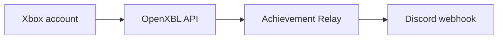

# Achievement Relay — Xbox achievements to Discord for Windows

Achievement Relay is an open-source Windows 10/11 app that checks your Xbox account for newly unlocked achievements and automatically posts them to a Discord channel webhook. It is designed for Xbox-enabled PC games, PC Game Pass titles, and other unlocks that appear on the connected Xbox profile.

[](https://github.com/Conroy1988/Achievement-Relay/actions/workflows/ci.yml)
[](LICENSE)
[](docs/INSTALL.md)
[](https://ko-fi.com/D4P124RWI9)

> [!IMPORTANT]
> Version 0.2 is a beta and uses [OpenXBL](https://xbl.io), an independent, unofficial Xbox API provider. You need your own OpenXBL account/API key and are also subject to OpenXBL's availability, limits, and terms. Achievement Relay is not affiliated with Microsoft, Xbox, OpenXBL, or Discord.

> [!WARNING]
> The 0.1.x Windows-notification approach cannot see achievements shown only in the Xbox Game Bar overlay. Upgrade to 0.2; it checks the Xbox account instead and does not require a Windows Notification Center toast.

## Highlights

- Checks the connected Xbox account about once a minute—no Game Bar scraping, OCR, or Windows notification permission.
- Posts a Discord embed with achievement name, game, Gamerscore, rarity, description, unlock time, player name, and artwork when the Xbox response supplies them.
- Creates a first-run baseline so installing the app never floods Discord with old achievements.
- Recovers achievements earned while the app was closed and retries failed Discord delivery without duplicate posts.
- Encrypts the OpenXBL API key and Discord webhook with Windows DPAPI for the current Windows user.
- Runs quietly in the system tray, supports Windows startup, and includes manual sync, diagnostics, activity history, and a safe redacted support summary.
- Provides a gaming-themed `.exe` installer with optional account setup, a clear **configure later** path, and a desktop-shortcut toggle.



No Xbox password, Microsoft password, Discord bot, public Achievement Relay server, or developer-operated relay service is required.

## Install and connect

1. Download `AchievementRelay_Setup.exe` from the [latest GitHub Release](https://github.com/Conroy1988/Achievement-Relay/releases/latest).
2. In the installer, choose either:
   - **Connect OpenXBL and Discord now** — paste your OpenXBL API key and Discord webhook; or
   - **Skip — I will do this later** — the app opens at Guided setup.
3. Choose whether to create a desktop shortcut and install.
4. On first launch, the app securely stores both secrets before it verifies the Xbox account and Discord channel, then establishes a no-spam baseline.
5. Leave Achievement Relay in the notification area while playing. A new unlock normally posts within about one minute.

The complete walkthrough is in [Getting Started](GETTING_STARTED.md). SmartScreen, signing, architecture selection, and manual installation are covered in [Installation](docs/INSTALL.md).

## Compatibility and limits

Achievement Relay can relay an unlock when:

- the game records an achievement on the connected Xbox network profile;
- OpenXBL returns that achievement and is reachable within the account's request allowance;
- Achievement Relay is running, or it is started after the offline unlock; and
- the PC can reach the configured Discord webhook.

Important limits:

- Steam-only achievements are not supported yet.
- Xbox may delay achievements earned offline before syncing them to the profile.
- The account feed can include console or cloud-gaming unlocks on the same Xbox account; version 0.2 does not reliably filter by device platform.
- Delivery is account polling, not instant push. The normal delay is approximately 0–60 seconds plus any Xbox/OpenXBL delay.
- OpenXBL currently publishes 150 requests/hour on its free plan. The relay monitors provider allowance headers, keeps a protected reserve, caps itself below that free allowance, and hydrates historical title identities gradually. Verify future plan changes on [OpenXBL pricing](https://xbl.io/pricing).

## Privacy and security

The API key is sent only to OpenXBL. Achievement details are sent to the Discord webhook selected by the user. The app has no analytics, ads, cloud database, or telemetry.

If account details are entered in the installer, they are passed through a one-time current-user DPAPI-encrypted handoff—never command-line arguments. The app first saves fresh encrypted settings, then deletes the handoff before attempting live verification. See [Privacy](PRIVACY.md), [Security](SECURITY.md), and [Architecture](docs/ARCHITECTURE.md) for the exact data flow.

## Build and test

Requirements:

- Windows 10 version 2004 (build 19041) or newer;
- [.NET 10 SDK](https://dotnet.microsoft.com/download/dotnet/10.0);
- Windows 10/11 SDK with `MakeAppx.exe` and `SignTool.exe`; and
- [Inno Setup 6](https://jrsoftware.org/isinfo.php) for `AchievementRelay_Setup.exe`.

```powershell
dotnet restore .\AchievementRelay.sln
dotnet build .\AchievementRelay.sln --configuration Release
dotnet run --project .\tests\AchievementRelay.Core.Tests --configuration Release
.\scripts\Test-Repository.ps1
```

Create x64 and Arm64 packages plus the setup executable:

```powershell
.\scripts\Build-Release.ps1 -Version 0.2.1.0
```

Maintainer instructions are in [Release Process](docs/RELEASING.md).
The provider payload matrix, detection invariants, retry policy, and live Windows gates are in [OpenXBL reliability research](docs/OPENXBL-RELIABILITY.md).

## Roadmap

- [x] Xbox account achievement polling through a user-supplied OpenXBL key
- [x] Discord webhook embeds, retry, deduplication, and offline recovery
- [x] DPAPI-protected secrets and redacted diagnostics
- [x] Gaming-themed guided installer and desktop-shortcut choice
- [ ] First-party Xbox integration if Microsoft makes an appropriate cross-title API available
- [ ] Trusted production signing and automatic updates
- [ ] Optional Steam achievement provider
- [ ] Additional outbound destinations

Issues and pull requests are welcome. Read [Contributing](CONTRIBUTING.md) before sharing diagnostics. Never post an OpenXBL API key or Discord webhook URL in an issue.

Original artwork and licensed interface assets are documented in [Third-party art notices](THIRD-PARTY-NOTICES.md). Public visibility alone is not treated as permission to redistribute an asset.

## Support the project

Achievement Relay is free and open source. If it makes sharing your unlocks easier, [support future development on Ko-fi](https://ko-fi.com/D4P124RWI9). The link is also available in the app's About screen; contributions are appreciated, never required.

## References

- [OpenXBL API documentation](https://api.xbl.io/docs)
- [OpenXBL pricing and request limits](https://xbl.io/pricing)
- [Discord Support: Intro to Webhooks](https://support.discord.com/hc/en-us/articles/228383668-Intro-to-Webhooks)
- [Microsoft: Xbox achievement JSON](https://learn.microsoft.com/gaming/gdk/docs/reference/live/rest/json/json-achievementv2)
- [Microsoft: Sign an MSIX package with SignTool](https://learn.microsoft.com/windows/msix/package/sign-app-package-using-signtool)

Xbox, Microsoft, Discord, Steam, OpenXBL, and related marks belong to their respective owners.
