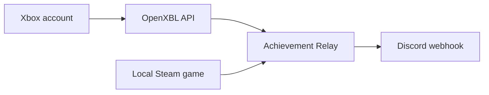

# Achievement Relay — Xbox and Steam achievements to Discord for Windows

Achievement Relay is an open-source Windows 10/11 app that watches Xbox and Steam for newly unlocked achievements and automatically posts them to a Discord channel webhook. Use Xbox, Steam, or both from one tray companion.

[](https://github.com/Conroy1988/Achievement-Relay/actions/workflows/ci.yml)
[](LICENSE)
[](docs/INSTALL.md)
[](https://ko-fi.com/D4P124RWI9)

> [!IMPORTANT]
> Version 0.3 is a beta. Xbox support uses [OpenXBL](https://xbl.io), an independent, unofficial provider that requires your own key and is subject to its availability, limits, and terms. Steam support is local and keyless. Achievement Relay is not affiliated with Microsoft, Xbox, Valve, Steam, OpenXBL, or Discord.

> [!WARNING]
> The 0.1.x Windows-notification approach cannot see achievements shown only in the Xbox Game Bar overlay. Upgrade to 0.3; it checks the Xbox account instead and does not require a Windows Notification Center toast.

## Highlights

- Checks the connected Xbox account about once a minute and locally watches the running Steam game—no Game Bar scraping, OCR, or Windows notification permission.
- Needs no Steam Web API key or Steam64 ID. It reads the signed-in local Steam client's read-only achievement state through an isolated Steamworks bridge.
- Posts a Discord embed with achievement name, game, platform, rarity, description, unlock time, player name, and artwork when the source supplies them.
- Creates a per-account, per-game baseline so installing the app never floods Discord with old achievements.
- Recovers Xbox achievements earned while the app was closed; Steam posts only directly observed live transitions and durably retries their failed Discord deliveries.
- Encrypts the OpenXBL API key and Discord webhook with Windows DPAPI for the current Windows user.
- Runs quietly in the system tray, supports Windows startup, and includes manual sync, diagnostics, activity history, and a safe redacted support summary.
- Provides a gaming-themed `.exe` installer with optional account setup, a clear **configure later** path, and a desktop-shortcut toggle.



No Xbox password, Microsoft password, Steam API key, Discord bot, public Achievement Relay server, or developer-operated relay service is required.

## Install and connect

1. Download `AchievementRelay_Setup.exe` from the [latest GitHub Release](https://github.com/Conroy1988/Achievement-Relay/releases/latest).
2. In the installer, choose either:
   - **Connect Discord now; add OpenXBL optionally** — paste the required webhook and, if using Xbox, your OpenXBL key; or
   - **Skip — I will do this later** — the app opens at Guided setup.
3. Choose whether to create a desktop shortcut and install.
4. On first launch, the app securely stores supplied secrets, verifies Discord and optional Xbox, and starts keyless Steam detection.
5. Leave Achievement Relay in the notification area while playing. Steam unlocks are observed locally; Xbox unlocks normally post within about one minute plus provider delay.

The complete walkthrough is in [Getting Started](GETTING_STARTED.md). SmartScreen, signing, architecture selection, and manual installation are covered in [Installation](docs/INSTALL.md).

## Compatibility and limits

Achievement Relay can relay an unlock when the configured Discord webhook is reachable and the selected source can prove the event is new:

- **Xbox:** the game records the achievement on the connected network profile, OpenXBL returns it within the account's request allowance, and Achievement Relay is running or starts after that offline unlock.
- **Steam:** the desktop Steam client and Achievement Relay are running before the unlock, and the helper receives Steam's completed-achievement callback or directly observes the locked-to-unlocked state change.

Important limits:

- A Steam game's first complete snapshot is a silent history baseline. A pre-baseline unlock qualifies only when Steam emits its completed-achievement callback during that helper session; unlock timestamps never authorize a post. Older or unprovable entries are deliberately not posted.
- Steam unlocks earned while Achievement Relay is closed are silently folded into the next baseline. This strict live-only rule prevents a restart from turning offline history into a Discord backlog.
- Steam games must publish achievements through Steamworks. Games without Steam achievements, or games whose stats never become available to the local Steam client, cannot be observed.
- Steam monitoring on Arm64 requires Windows 11's x64 emulation. Xbox monitoring remains available on Windows 10 Arm64.
- Xbox may delay achievements earned offline before syncing them to the profile.
- The account feed can include console or cloud-gaming unlocks on the same Xbox account; it does not reliably identify the device platform.
- Delivery is account polling, not instant push. The normal delay is approximately 0–60 seconds plus any Xbox/OpenXBL delay.
- OpenXBL currently publishes 150 requests/hour on its free plan. The relay monitors provider allowance headers, keeps a protected reserve, caps itself below that free allowance, and hydrates historical title identities gradually. Verify future plan changes on [OpenXBL pricing](https://xbl.io/pricing).

## Privacy and security

The optional Xbox API key is sent only to OpenXBL. Steam achievement state is read locally; no personal Steam key or Steam account credential is collected. For rarity, the app can make one cached request per game to Steam's public global-percentage endpoint only after a new unlock. Achievement details and optional artwork are sent to the Discord webhook selected by the user. The app has no analytics, ads, cloud database, or telemetry.

If account details are entered in the installer, they are passed through a one-time current-user DPAPI-encrypted handoff—never command-line arguments. The app first saves fresh encrypted settings, then deletes the handoff before attempting live verification. See [Privacy](PRIVACY.md), [Security](SECURITY.md), and [Architecture](docs/ARCHITECTURE.md) for the exact data flow.

## Build and test

Requirements:

- Windows 10 version 2004 (build 19041) or newer;
- [.NET 10 SDK](https://dotnet.microsoft.com/download/dotnet/10.0);
- Windows 10/11 SDK with `MakeAppx.exe` and `SignTool.exe`; and
- [Inno Setup 6](https://jrsoftware.org/isinfo.php) for `AchievementRelay_Setup.exe`.

```powershell
dotnet restore .\AchievementRelay.sln
dotnet build .\AchievementRelay.sln --configuration Release
dotnet run --project .\tests\AchievementRelay.Core.Tests --configuration Release
.\scripts\Test-Repository.ps1
```

Create x64 and Arm64 packages plus the setup executable:

```powershell
.\scripts\Build-Release.ps1 -Version 0.3.0.0
```

Maintainer instructions are in [Release Process](docs/RELEASING.md).
The provider payload matrix, detection invariants, retry policy, and live Windows gates are in [OpenXBL reliability research](docs/OPENXBL-RELIABILITY.md).
The Steam reference-tool research, local bridge design, anti-backlog invariants, privacy boundary, and Windows test matrix are in [Steam integration research](docs/STEAM-INTEGRATION.md).

## Roadmap

- [x] Xbox account achievement polling through a user-supplied OpenXBL key
- [x] Discord webhook embeds, retry, deduplication, Xbox offline recovery, and strict live-only Steam monitoring
- [x] DPAPI-protected secrets and redacted diagnostics
- [x] Gaming-themed guided installer and desktop-shortcut choice
- [ ] First-party Xbox integration if Microsoft makes an appropriate cross-title API available
- [ ] Trusted production signing and automatic updates
- [x] Local, keyless Steam achievement monitoring with per-game baseline protection
- [ ] Additional outbound destinations

Issues and pull requests are welcome. Read [Contributing](CONTRIBUTING.md) before sharing diagnostics. Never post an OpenXBL API key or Discord webhook URL in an issue.

Original artwork and licensed interface assets are documented in [Third-party art notices](THIRD-PARTY-NOTICES.md). Public visibility alone is not treated as permission to redistribute an asset.

## Support the project

Achievement Relay is free and open source. If it makes sharing your unlocks easier, [support future development on Ko-fi](https://ko-fi.com/D4P124RWI9). The link is also available in the app's About screen; contributions are appreciated, never required.

## References

- [OpenXBL API documentation](https://api.xbl.io/docs)
- [OpenXBL pricing and request limits](https://xbl.io/pricing)
- [Discord Support: Intro to Webhooks](https://support.discord.com/hc/en-us/articles/228383668-Intro-to-Webhooks)
- [Steamworks: SteamAPI initialization](https://partner.steamgames.com/doc/api/steam_api)
- [Steamworks: ISteamUserStats](https://partner.steamgames.com/doc/api/ISteamUserStats)
- [Microsoft: Xbox achievement JSON](https://learn.microsoft.com/gaming/gdk/docs/reference/live/rest/json/json-achievementv2)
- [Microsoft: Sign an MSIX package with SignTool](https://learn.microsoft.com/windows/msix/package/sign-app-package-using-signtool)

Xbox, Microsoft, Discord, Steam, OpenXBL, and related marks belong to their respective owners.
