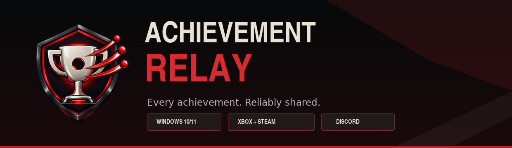
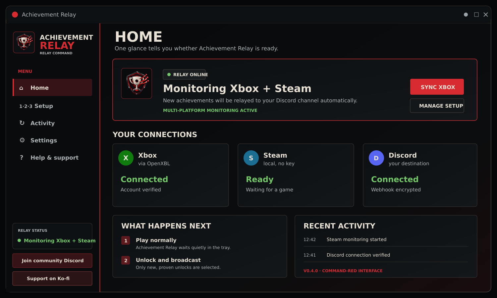
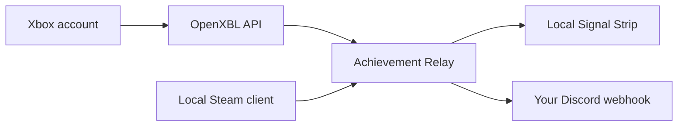

# Achievement Relay

Relay new Xbox and local Steam achievements to Discord from one secure Windows tray app.

[](https://github.com/Conroy1988/Achievement-Relay/releases/latest)
[](https://github.com/Conroy1988/Achievement-Relay/actions/workflows/ci.yml)
[](docs/INSTALL.md)
[](LICENSE)
[](https://discord.gg/3ZdXhYjgDm)
[](https://ko-fi.com/D4P124RWI9)

[**Download for Windows**](https://github.com/Conroy1988/Achievement-Relay/releases/latest/download/AchievementRelay_Setup.exe) · [Getting started](GETTING_STARTED.md) · [Release notes](docs/RELEASE-NOTES-0.6.0.md) · [Accessibility](docs/ACCESSIBILITY.md) · [Community & Support](https://discord.gg/3ZdXhYjgDm)



## One simple relay

Achievement Relay watches the Xbox account you connect and the Steam game running on your PC. When it can prove an achievement is new, it sends a rich post to the Discord channel you choose.

- **Xbox:** checks your account through your own [OpenXBL](https://xbl.io) API key and relays unlocks proven during the current live monitoring session.
- **Steam:** reads the signed-in local Steam client's achievement state through an isolated, read-only bridge. No Steam Web API key, Steam64 ID, or Steam password is required.
- **On screen:** celebrates each proven live unlock with a compact, silent Signal Strip at the top of the active display without taking focus from the game.
- **Discord:** sends a full-width Collector Card with game, platform, rarity tier, global unlock percentage and artwork, while retaining the important facts as accessible text.
- **Safe by default:** first observations become silent baselines, so installing or upgrading cannot dump years of old achievements into Discord.
- **Private:** the Discord webhook and optional OpenXBL key are encrypted for the current Windows account with DPAPI. There is no analytics service, advertising, cloud database, or developer-operated relay server.
- **Quiet:** runs in the notification area, supports Windows startup, retains failed live deliveries for retry, and includes redacted diagnostics.

## What's new in v0.6

> **Signal Strip overlay:** newly proven live achievements now appear in a compact top-centre banner for five seconds. It uses the achievement artwork or Relay fallback, the matching rarity emblem and percentage, platform, and Gamerscore without interrupting play.

> **Passive by design:** the overlay is click-through, never takes keyboard focus, makes no sound, and serialises consecutive achievements through a bounded queue rather than stacking banners across the game.

- The overlay is enabled by default for new and upgraded installations and can be disabled at any time in **Settings**.
- Bronze, Silver, Gold, Platinum and Unranked use the same honest percentage rules as Discord Collector Cards.
- Existing history, startup reconciliation and other unproven observations remain silent; the overlay cannot weaken the anti-backlog boundary.

v0.6 also upgrades the established Collector Card presentation:

> **Collector Cards:** every achievement arrives as a wide rarity card with a much larger foreground artwork showcase, suitable wide ambient art and local dark readability panels. Small or square icons stay contained instead of being stretched across the card; otherwise the composition uses the polished black, red and metallic Achievement Relay fallback.

> **Readable at Discord size:** the achievement title, description and game are substantially larger, while the exact rarity percentage remains the visual anchor. Validated percentages still drive four distinct emblems—Bronze at 25% or more, Silver at 10–24.99%, Gold at 3–9.99%, and Platinum below 3%. Missing or invalid percentages use an honest neutral Unranked card.

> **Corrected Xbox PC identity:** a recognized, non-conflicting singular Windows value on the achievement—such as `WindowsOneCore`—labels a PC Game Pass unlock **Xbox PC** when OpenXBL supplies it, before title compatibility is considered. Direct console evidence can be labelled **Xbox Console**, and legacy achievements can be labelled **Xbox 360**. Conflicting event-level values, plural supported-platform lists and incomplete responses without a recognized singular value remain simply **Xbox** rather than being guessed.

- Cards are rendered locally and delivered only to the configured Discord webhook.
- Tier meaning is repeated through emblem shape, internal marks, written name and ordinary Discord text—not color alone.
- The sample-achievement action previews the real production card and premium fallback design.
- Missing or unsuitable artwork never blocks an achievement post.

The established v0.4 reliability work remains in place:

> **v0.4.1 readability update:** the app now keeps every content surface dark under Windows light mode, explicitly protects card/list foregrounds, improves hover, disabled and keyboard-focus states, and enforces its measured contrast palette in CI. See the [v0.4.1 release notes](docs/RELEASE-NOTES-0.4.1.md) and [accessibility audit](docs/ACCESSIBILITY.md).

> **v0.4.3 startup hotfix:** every visible launch—including the verified updater relaunch—now selects and renders Home deterministically instead of exposing an empty dark content surface. See the [v0.4.3 release notes](docs/RELEASE-NOTES-0.4.3.md).

- A complete high-contrast **command-red** interface with clearer status, setup, activity, settings, and help screens.
- A new Achievement Relay shield-and-trophy identity across the app, installer, Windows package, and GitHub project.
- A featured **Community & Support** experience linking directly to the [TKB community Discord](https://discord.gg/3ZdXhYjgDm), while retaining Ko-fi support.
- A verified self-updater that checks on launch and about every six hours, prepares optional updates quietly, and immediately handles authenticated required updates.
- The CRNY **Relay Online** soundtrack at a fixed 10% volume with Play/Pause and a direct [SoundCloud link](https://soundcloud.com/daniel-conroy-224318319/crny-relay-online); fresh installs may play it, while updaters start muted until **Play music** is selected.
- Local, keyless Steam monitoring alongside the existing Xbox relay, with strict anti-backlog rules for both sources.

See the [v0.6.0 release notes](docs/RELEASE-NOTES-0.6.0.md), [v0.5.0 Collector Card notes](docs/RELEASE-NOTES-0.5.0.md), [v0.4.3 startup-hotfix notes](docs/RELEASE-NOTES-0.4.3.md), [v0.4.2 relay-safety notes](docs/RELEASE-NOTES-0.4.2.md), [v0.4.1 accessibility notes](docs/RELEASE-NOTES-0.4.1.md), [v0.4.0 launch notes](docs/RELEASE-NOTES-0.4.0.md), and [changelog](CHANGELOG.md).

> [!IMPORTANT]
> **Moving from a pre-official 0.3.x updater test:** install v0.4.0 once from this repository's official release page. The 0.3.x test builds used an intentionally temporary signing identity whose private key was destroyed, so they cannot authenticate the new permanent release channel. Your encrypted connections, settings, baselines, pending deliveries, and preferences remain in place. Automatic verified updates take over from v0.4.0 onward.

> [!IMPORTANT]
> **First-install Windows trust:** v0.4.0 uses a persistent, project-owned self-signed certificate. SmartScreen may appear, and Setup asks for administrator approval once to add only the public **Achievement Relay Open Source** certificate to Windows Trusted People. Later automatic updates reuse that exact pinned identity. See the [signing notice](docs/INSTALL.md#signing-notice) and its [public fingerprint](release/publisher-certificate.json).

> [!NOTE]
> Xbox support uses OpenXBL, an independent and unofficial provider that requires your own key and is subject to its availability, limits, and terms. Achievement Relay is not affiliated with Microsoft, Xbox, Valve, Steam, OpenXBL, or Discord.

## Install in minutes

1. Download [`AchievementRelay_Setup.exe`](https://github.com/Conroy1988/Achievement-Relay/releases/latest/download/AchievementRelay_Setup.exe).
2. Approve the one-time Windows certificate-trust prompt if this PC has not installed an official Achievement Relay release before.
3. Choose Xbox, Steam, or both. You may connect now or finish in the app's step-by-step Setup screen.
4. Add the Discord webhook for the channel that should receive achievements. Add an OpenXBL key only if you want Xbox monitoring.
5. Finish setup and play normally. Achievement Relay stays in the notification area and posts only newly proven unlocks.

The installer selects x64 or Arm64 automatically. Release packages are self-contained, so users do not need to install .NET. See [Getting Started](GETTING_STARTED.md) for the walkthrough and [Installation](docs/INSTALL.md) for signing, SmartScreen, architecture, and manual fallback details.

## How it works



No Xbox password, Microsoft password, Steam account credential, Steam API key, Discord bot, or hosted Achievement Relay account is required.

### Detection boundaries

- The first complete Xbox or Steam observation is a silent history baseline.
- Xbox begins a fresh live-delivery epoch whenever the app starts or resumes after a long interruption. Account progress from before that epoch is folded into the local identity baseline without posting, preventing a PC used later from replaying achievements already relayed by another device.
- A timestamped Xbox unlock after the epoch remains eligible immediately. An untimestamped Xbox 360 unlock is eligible only after a successful poll in the same uninterrupted session; proven pending delivery evidence survives an updater/app restart.
- Deduplication state is local and Achievement Relay has no hosted account service. Two PCs actively monitoring the same Xbox account at the same moment can still race, so keep Xbox relay monitoring active on only one PC at a time. Sequential device handoffs are protected by the fresh epoch above.
- Steam posts only a locked-to-unlocked transition directly observed while the app is running, or Steam's completed-achievement callback from that helper session. Offline Steam history is deliberately folded into the next silent baseline.
- Steam games must publish achievements through Steamworks. Steam monitoring on Arm64 requires Windows 11 x64 emulation; Xbox remains available on Windows 10 Arm64.
- Xbox delivery is account polling rather than instant push: normal delay is approximately 0–60 seconds plus Xbox/OpenXBL propagation time.
- OpenXBL's service limits can change. Achievement Relay tracks allowance headers, preserves a protected request reserve, and gradually hydrates historical identity data. Check [OpenXBL pricing](https://xbl.io/pricing) for current limits.

## Verified automatic updates

Achievement Relay checks the official stable GitHub release on launch and periodically while running. It accepts an update only after all of these agree:

- the GitHub release tag and signed manifest versions;
- the exact installer asset name, size, and SHA-256;
- the installer's embedded product and package versions;
- Windows Authenticode trust; and
- the publisher-certificate fingerprint pinned into the running app.

Optional updates found while running are prepared without interrupting play and open on the next launch. A reviewed, authenticated release can raise the minimum supported version; only then does monitoring pause and the updater open immediately. Offline checks, unsigned manifests, altered files, and failed validation never invent a required update.

The first install explicitly trusts the project's public leaf certificate; later installers must pass Windows validation and the independent certificate pin above. The full trust model and certificate-rotation rules are documented in [Installation](docs/INSTALL.md), [Security](SECURITY.md), and [Release Process](docs/RELEASING.md).

## Privacy and security

The optional Xbox API key is sent only to OpenXBL. Steam state is read locally; optional rarity and public library hero art use credential-free Steam endpoints only after an eligible new unlock. Collector Cards are rendered on the PC. Achievement details and the finished composed card—not a raw provider image upload—are sent only to the Discord webhook selected by the user.

Installer-entered secrets use a one-time current-user DPAPI-encrypted handoff—never command-line arguments—and are deleted after durable import. Read [Privacy](PRIVACY.md), [Security](SECURITY.md), and [Architecture](docs/ARCHITECTURE.md) for the exact data flow.

## Build and test

Building requires Windows 10 2004 or newer, the [.NET 10 SDK](https://dotnet.microsoft.com/download/dotnet/10.0), Windows 10/11 SDK packaging tools, and [Inno Setup 6](https://jrsoftware.org/isinfo.php).

```powershell
dotnet restore .\AchievementRelay.sln
dotnet build .\AchievementRelay.sln --configuration Release
dotnet run --project .\tests\AchievementRelay.Core.Tests --configuration Release
dotnet run --project .\tests\AchievementRelay.App.Tests --configuration Release
.\scripts\Test-Repository.ps1
.\scripts\Build-Release.ps1 -Version 0.6.0.0
```

Maintainer instructions are in [Release Process](docs/RELEASING.md). Detailed reliability and provider research is available in [OpenXBL reliability](docs/OPENXBL-RELIABILITY.md) and [Steam integration](docs/STEAM-INTEGRATION.md).

## Community & Support

Need help, want to share feedback, or just want to talk games? [Join the TKB community Discord](https://discord.gg/3ZdXhYjgDm). Please use a redacted diagnostic summary and never post an OpenXBL key or Discord webhook URL.

Achievement Relay is free and open source. If it makes sharing your wins easier, you can also [support future development on Ko-fi](https://ko-fi.com/D4P124RWI9). Contributions are appreciated, never required.

Issues and pull requests are welcome; please read [Contributing](CONTRIBUTING.md). Original artwork and licensed interface assets are covered by [Third-party art notices](THIRD-PARTY-NOTICES.md).

Xbox, Microsoft, Discord, Steam, OpenXBL, and related marks belong to their respective owners.
