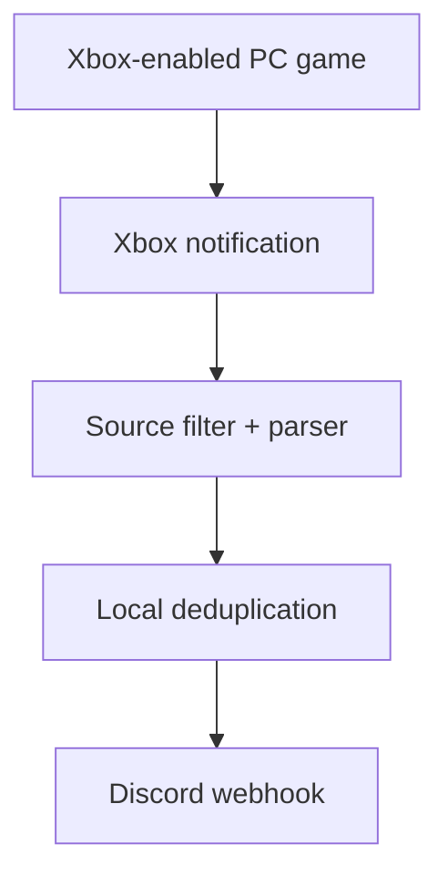

# Achievement Relay

**Xbox achievement notifications for Discord on Windows.** Achievement Relay is an open-source Windows tray app that detects Xbox achievements unlocked in supported PC games and automatically posts a rich notification to a Discord channel webhook.

[](https://github.com/Conroy1988/Achievement-Relay/actions/workflows/ci.yml)
[](LICENSE)
[](docs/INSTALL.md)

> [!IMPORTANT]
> Achievement Relay is an early alpha. The notification formats used by Xbox can vary by game, Windows language, and Xbox app version. Use the **Activity** and **Diagnostics** screens when testing and report missed formats with a redacted support summary.

## What it does

- Watches Windows Notification Center with the user-approved `UserNotificationListener` API.
- Checks sender identity before reading notification text and discards non-Xbox senders.
- Recognizes achievement unlock text and Gamerscore across several common languages.
- Posts a Discord embed with the achievement name, description, game, Gamerscore, rarity, and optional player name when those values are present.
- Encrypts the Discord webhook for the current Windows account with DPAPI.
- Prevents duplicate posts with a bounded 90-day local event ledger.
- Runs quietly in the Windows notification area and can configure startup for the user.
- Includes a four-step first-run guide, live webhook test, sample achievement, activity log, and diagnostics.



No Xbox password, Microsoft account token, Discord bot, public server, or cloud relay is required.

## Quick start

1. Download the latest `AchievementRelay_*_installer.zip` from **Releases**.
2. Extract the ZIP and run `Install.ps1` with PowerShell.
3. In Achievement Relay, grant Windows notification access.
4. Confirm Xbox/Game Bar achievement notifications are enabled.
5. Create a Discord channel webhook, paste its URL, and select **Save and test**.
6. Choose startup behaviour and select **Finish setup**.

The installer and every first-run screen are documented in [Getting Started](GETTING_STARTED.md). Alpha certificate details are in [Installation](docs/INSTALL.md).

## Compatibility

Achievement Relay can detect an unlock when all of these are true:

- The PC game uses Xbox network achievements.
- Xbox Game Bar or the Xbox app creates an achievement notification on that PC.
- Achievement Relay is running, or the notification remains in Notification Center and the user selects **Re-scan**.
- Windows notification access has been granted.
- The computer can reach Discord.

Steam-only achievements are not supported yet. Games that record an Xbox achievement without creating a Windows notification cannot be observed by this first release. Offline unlocks may arrive later after Xbox validates and surfaces the achievement.

## Why notification access?

Microsoft's achievement API is designed primarily for the title that owns the achievement and requires Xbox service onboarding. It is not a general-purpose feed for every game a player owns. Achievement Relay therefore uses the official Windows notification-listener capability for its public MVP.

Windows describes that capability broadly because it can expose notifications from other apps. Achievement Relay minimizes that access in code: it checks package/display identity first, reads text only for known Xbox senders, keeps no unrelated content, and contains no telemetry. See [Privacy](PRIVACY.md) and [Architecture](docs/ARCHITECTURE.md).

## Build and test

Requirements:

- Windows 10 version 2004 (build 19041) or newer
- [.NET 10 SDK](https://dotnet.microsoft.com/download/dotnet/10.0)
- Windows 10/11 SDK with `MakeAppx.exe` and `SignTool.exe` for packaging

```powershell
dotnet restore .\AchievementRelay.sln
dotnet build .\AchievementRelay.sln --configuration Release
dotnet run --project .\tests\AchievementRelay.Core.Tests --configuration Release
.\scripts\Test-Repository.ps1
```

To create installable x64 and Arm64 development packages:

```powershell
.\scripts\Build-Release.ps1 -Version 0.1.0.0
```

The notification listener requires package identity and the manifest capability, so test real capture from an installed MSIX rather than an unpackaged `dotnet run` process. Maintainer signing and release instructions are in [Release Process](docs/RELEASING.md).

## Project status and roadmap

- [x] Xbox/Game Bar notification capture
- [x] Discord webhook embeds
- [x] Permission-first setup and tray operation
- [x] Local encryption, source filtering, deduplication, and diagnostics
- [ ] Expand parser fixtures from real-world, redacted notification formats
- [ ] Signed stable installer and automated update channel
- [ ] Optional Steam achievement provider
- [ ] Additional outbound destinations

Issues and pull requests are welcome. Read [Contributing](CONTRIBUTING.md) before sharing diagnostics, and never post a Discord webhook URL in an issue.

Release history is recorded in the [Changelog](CHANGELOG.md).

## Official references

- [Microsoft: Notification listener](https://learn.microsoft.com/windows/apps/develop/notifications/app-notifications/notification-listener)
- [Xbox Support: Manage Xbox and app pop-up notifications](https://support.xbox.com/help/hardware-network/settings-updates/pop-up-notifications)
- [Discord Support: Intro to Webhooks](https://support.discord.com/hc/en-us/articles/228383668-Intro-to-Webhooks)
- [Microsoft: Sign an MSIX package with SignTool](https://learn.microsoft.com/windows/msix/package/sign-app-package-using-signtool)

Achievement Relay is not affiliated with, endorsed by, or sponsored by Microsoft, Xbox, or Discord. Xbox, Microsoft, Discord, Steam, and related marks belong to their respective owners.
