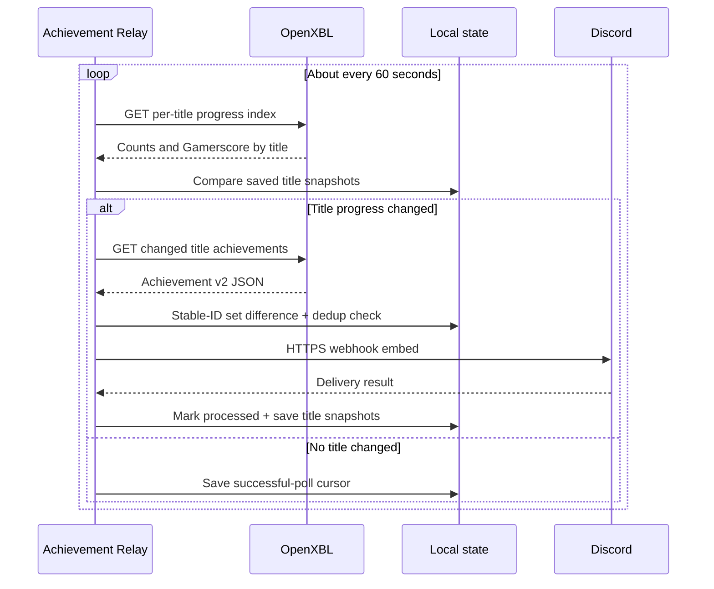
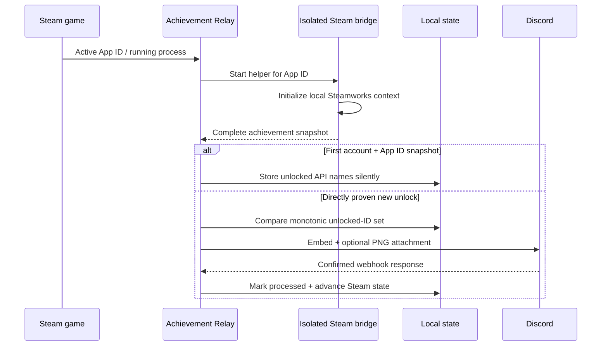

# Architecture

Achievement Relay is a local Windows desktop app with three projects:

- `AchievementRelay.Core` contains platform-neutral OpenXBL parsing, Xbox and Steam delta rules, PNG encoding, validation, deterministic event identity, settings models, and Discord payload construction.
- `AchievementRelay.App` contains the WPF/tray UI, provider coordinators, OpenXBL/Steam-rarity/Discord HTTP clients, Steam game detection, DPAPI secret storage, durable provider state, the shared event ledger, installer import, startup integration, and logging.
- `AchievementRelay.SteamBridge` is a minimal x64 .NET Framework helper that reads the active App ID's local Steamworks achievement state and emits versioned complete snapshots over redirected standard I/O. It has no Discord, settings, or write-to-Steam responsibility.

The MSIX manifest supplies package identity, `internetClient`, `runFullTrust`, the packaged startup task, and unvirtualized per-user AppData. The app's durable state remains under `%LOCALAPPDATA%\AchievementRelay`, with both the legacy full-trust declaration and an explicit Windows 11 virtualization exclusion. The one-time installer handoff uses `%USERPROFILE%\.achievement-relay` instead, which is outside AppData virtualization. Version 0.3 has no `userNotificationListener` capability.

## Xbox poll and delivery path

`OpenXblClient` sends the user-supplied key only in the `X-Authorization` header to OpenXBL's `https://api.xbl.io/` service. The client tries the documented `/api/v2/` current-account operations first and can fall back to the provider's live `/v2/` compatibility paths. Account and title-history routes are cached after readable JSON; per-title detail routes are cached only after their parsed unlocked count reaches the title-history count. Requests time out after 20 seconds and response buffering is capped at 20 MiB. Provider and network failures become user-safe messages; the key is never included.

## Steam observation and delivery path

The app detects `RunningAppID`, parses Steam libraries/manifests, and has a cached running-executable fallback. The helper uses the signed-in local Steam client and never asks for a Web API key or account credential. Changed state is sampled every 500 ms and a complete heartbeat is emitted every 15 seconds. The helper is restarted after bounded failures and exits with the parent app.

## Baseline, recovery, and duplicates

On the first verified account connection, `XboxSyncStateStore` records the first successful title-progress snapshot and a baseline timestamp. Summary counts are never treated as verified identity sets. Detailed stable identities are established gradually in the background or when each title first changes, and every pre-existing identity is recorded without posting.

Each successful poll records `LastSuccessfulPollUtc` and per-title unlocked count/current Gamerscore; after a title's first complete detail response, its snapshot also holds the complete set of stable unlocked achievement identities. The inexpensive current-account `player/titleHistory` index is preferred for the one-minute poll; compatible title-index routes are probed only until one succeeds. Changed summaries are added to a durable queue without advancing their processed count. At most one queued title is expanded per sync: a change to an identity-verified or post-baseline-played title is prioritised, while old-history work uses the background schedule. A readable but count-mismatched result does not end route negotiation: the client also tries OpenXBL's canonical player/title and dedicated Xbox 360 operations until the parsed unlocked count exactly matches the title-history count, follows documented per-title continuation tokens when required, then caches that complete route for the individual title. If no compatible route is available, automatic probes back off for five minutes. Titles and pending work omitted from a later provider page remain in local state so they cannot reappear as false new games.

After a verified identity baseline exists, new events are the set difference between the current complete identity set and the saved set; unlock timestamps are display metadata only. Xbox 360 responses with a missing or `0001-01-01` time remain valid new entries and use the observation time in Discord with an explicit estimated-time footer. Before that identity baseline exists, counts and Gamerscore can never infer a post: only a usable timestamp strictly after the app's monitoring baseline may be delivered, while all old or unproven identities are stored silently. `EventLedger` prevents already handled deterministic identities from posting twice. The cursor/title snapshot is not advanced past a pending provider or Discord delivery.

Even a zero-achievement summary starts unverified until its detail response is read. Historical queue work and unchanged count-only hydration share one background slot every 15 minutes, never run from a manual **Sync now**, and never post unproven history. This makes the most recently played titles timestamp-independent without issuing a setup-time or later-page burst. Titles first revealed on a later provider page are baselined silently, so a newly visible old game cannot dump its backlog. Durable counts, Gamerscore, IDs, and queued target counts never shrink on a regressive or partial provider response.

Every outbound OpenXBL request is admitted by two budgets. A detail operation can issue at most 12 route/paging requests, and the process can issue at most 120 requests in any rolling hour even without provider headers. When OpenXBL returns its limit, remaining, or reset headers, those values add stricter live and background reserves. Low-priority history stops first; essential monitoring also pauses before the final reserve and honors the complete reset delay. Manual sync uses the same gate.

Once a title's identity baseline is verified, offline recovery has no time window: after several days offline, every genuinely new stable ID remains a candidate even when its provider timestamp is missing. An unverified title deliberately fails closed and baselines an old or missing-time identity rather than risk sending historical history.

Event IDs are SHA-256 hashes over a version marker, account XUID, service configuration, title, and achievement identifier. Upstream corrections to an unlock timestamp therefore cannot create a duplicate post. The ledger is capped at 1,000 entries and 90 days.

Steam uses a separate state file with the same fail-closed philosophy. The x64 helper waits for Steam's current-user-stats callback and three stable nonempty schema reads before producing its first snapshot; it resets that in-memory baseline whenever Steam unloads the stats. A monotonic unload generation is observed even when unload/reload callbacks occur between polling ticks, and a changed Steam account ID is an independent reset boundary. Its event ID hashes a Steam marker, Steam account ID, App ID, and achievement API name. Every helper session marks its first complete snapshot as history. Eligibility requires both an API name absent from the durable monotonic unlocked set and direct live proof from either the helper's in-memory locked-to-unlocked observation or Steam's completed-achievement callback during that helper lifetime. That callback closes the launch-to-first-snapshot race; timestamps are display metadata and never authorize a post. Proven transitions repeat on complete helper heartbeats until the main app persists them. Eligible identities are written to a durable pending set before Discord is called and are removed only after the shared delivery service accepts, filters, or deduplicates them. Relocks and regressive snapshots never remove saved IDs.

## Parsing boundary

`OpenXblResponseParser` accepts the Xbox Achievement v2-style JSON returned by OpenXBL. It:

1. accepts a documented `achievements` collection or root array;
2. keeps only entries explicitly marked achieved, including the Xbox 360 `unlocked` boolean;
3. rejects revoked entries while retaining achieved entries with missing or sentinel legacy times;
4. maps title, description, Gamerscore, rarity, and icon when available; and
5. deduplicates by deterministic event identity.

The parser never interprets response data as code and does not log raw provider responses.

## Secrets and local state

| File | Contents |
|---|---|
| `settings.json` | Preferences, XUID, gamertag, and current-user DPAPI ciphertext for OpenXBL/Discord secrets |
| `xbox-sync-state.json` | Account ID, first-run baseline, poll/background timestamps, per-title count/Gamerscore/stable-ID snapshots, and the durable pending-title queue |
| `steam-sync-state.json` | Steam account ID and per-App-ID monitoring time, last observation, game name, monotonic unlocked API-name set, and pending live deliveries |
| `processed-events.json` | Bounded deterministic IDs and processed timestamps |
| `achievement-relay.log` | Size-bounded operational messages; no intentional credentials or raw JSON |

`SecureWebhookProtector` retains the original webhook DPAPI entropy for upgrade compatibility and uses separate entropy for the OpenXBL API key. Decrypted byte arrays are zeroed after conversion; managed strings remain subject to normal .NET lifetime behavior.

## Installer handoff

The Inno Setup UI requires Discord when configure-now is chosen and accepts an optional OpenXBL key in password-masked controls. Steam needs no credential. Setup does not add secrets to a process command line. Instead:

1. short-lived process environment variables are inherited by `Protect-InstallerSetup.ps1`;
2. that process applies current-user DPAPI using the same per-secret entropy as the app;
3. only ciphertext is written to `%USERPROFILE%\.achievement-relay\pending-installer-setup.json`;
4. installer variables/fields are cleared;
5. `InstallerSetupImporter` decrypts and validates the file;
6. normal settings are durably saved with fresh DPAPI ciphertext;
7. the handoff is truncated and deleted; and
8. only then does the importer verify Discord and any supplied OpenXBL key.

If durable settings storage fails, the encrypted handoff is retained for the next launch. Version 0.2.1 also reads the legacy `%LOCALAPPDATA%\AchievementRelay` handoff path for compatibility. If setup is skipped, no handoff file is created.

## Upgrade behavior

The app queries GitHub's latest stable release endpoint at startup and approximately every six hours, caching the ETag, exact manifest bytes, and detached signature in `update-state.json`. The app authenticates both fresh and cached manifest bytes with RSA/SHA-256 using the embedded certificate and the running build's publisher pin. Update selection compares both the three-part product version and four-part MSIX package version, so the reserved beta package lane can upgrade cleanly to the same-product final package. A higher version is optional unless the signed manifest's reviewed `minimumSupportedVersion` is above the running product version. At launch, any verified update is downloaded and the updater opens automatically. While the app is running, optional updates are downloaded and prepared for the next launch; newly required updates pause both coordinators and open the updater immediately. A per-version session circuit breaker prevents a failed or cancelled automatic attempt from relaunching in a loop, while the explicit Retry/Install action remains available. Only a successfully authenticated required policy (or its revalidated cached state) can pause monitoring; a timeout, bad signature, or offline check does not create a requirement.

Downloads are limited to the exact `AchievementRelay_Setup.exe` asset on the official release. The app bounds redirects to GitHub-owned HTTPS hosts and verifies the release tag, signed product/package versions, asset size, SHA-256, executable product/file version resources, Windows Authenticode result, and an embedded SHA-256 fingerprint for the publisher certificate. It repeats file and signature checks just before launch. The same Inno Setup executable switches to `/UPDATE=1`, skips onboarding/task pages, keeps the desktop shortcut as-is, and calls `Add-AppxPackage` on the higher package identity. Per-user state under `%LOCALAPPDATA%\AchievementRelay` is outside the package and remains intact.

Settings schema 1 is migrated through schema 2 to schema 3 while retaining encrypted secrets and preferences. A completed 0.2 Xbox/Discord setup remains complete; Steam is added without resetting the Xbox cursor. A 0.1.x user must still choose a current achievement source. Legacy notification capture classes and manifest permissions remain removed.

Xbox sync-state schemas 2–4 migrate to schema 5 without discarding saved counts, Gamerscore, cursors, or verified identity sets. Schema 5 adds the durable pending-title queue and last background-work time. Schema-3 zero-count snapshots are reopened as unverified because they were created without a detail request. The first complete detail response stores the full ID set; only a trustworthy timestamp after the monitoring baseline can post during that transition, and count/Gamerscore inference is forbidden.

The provider research, failure matrices, and Windows release gates are maintained in [OpenXBL reliability research](OPENXBL-RELIABILITY.md) and [Steam integration research](STEAM-INTEGRATION.md).
