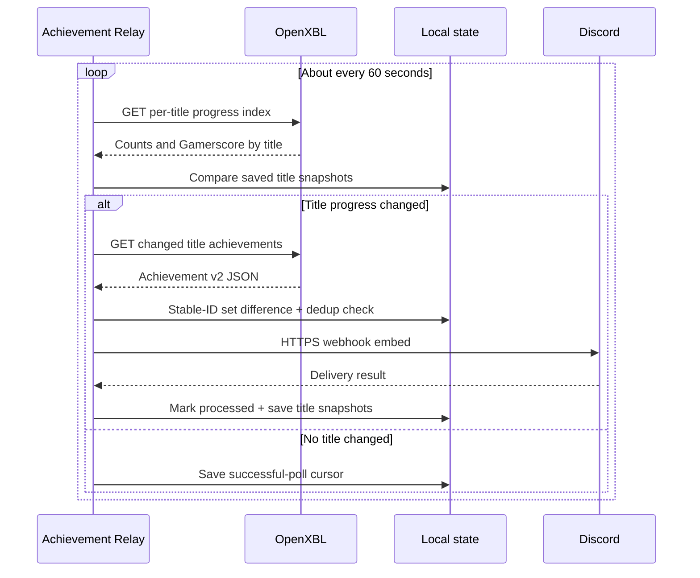

# Architecture

Achievement Relay is a local Windows desktop app with two projects:

- `AchievementRelay.Core` contains platform-neutral OpenXBL response parsing, API-key/webhook validation, deterministic event identity, settings models, and Discord payload construction.
- `AchievementRelay.App` contains the WPF/tray UI, OpenXBL and Discord HTTP clients, DPAPI secret storage, account polling, baseline/cursor state, event ledger, installer import, startup integration, and logging.

The MSIX manifest supplies package identity, `internetClient`, `runFullTrust`, the packaged startup task, and unvirtualized per-user AppData. The app's durable state remains under `%LOCALAPPDATA%\AchievementRelay`, with both the legacy full-trust declaration and an explicit Windows 11 virtualization exclusion. The one-time installer handoff uses `%USERPROFILE%\.achievement-relay` instead, which is outside AppData virtualization. Version 0.2 intentionally has no `userNotificationListener` capability.

## Poll and delivery path

`OpenXblClient` sends the user-supplied key only in the `X-Authorization` header to OpenXBL's `https://api.xbl.io/` service. The client tries the documented `/api/v2/` current-account operations first and can fall back to the provider's live `/v2/` compatibility paths. Account and title-history routes are cached after readable JSON; per-title detail routes are cached only after their parsed unlocked count reaches the title-history count. Requests time out after 20 seconds and response buffering is capped at 20 MiB. Provider and network failures become user-safe messages; the key is never included.

## Baseline, recovery, and duplicates

On the first verified account connection, `XboxSyncStateStore` records the first successful title-progress snapshot and a baseline timestamp. Achievements already represented by those counts are intentionally ignored, preventing historical Discord floods. Detailed stable identities are established gradually in the background or when each title first changes.

Each successful poll records `LastSuccessfulPollUtc` and per-title unlocked count/current Gamerscore; after a title's first complete detail response, its snapshot also holds the complete set of stable unlocked achievement identities. The inexpensive current-account `player/titleHistory` index is preferred for the one-minute poll; compatible title-index routes are probed only until one succeeds. A title-specific achievement route is requested only for new or changed titles. A readable but count-mismatched result does not end route negotiation: the client also tries OpenXBL's canonical player/title and dedicated Xbox 360 operations until the parsed unlocked count exactly matches the title-history count, follows documented per-title continuation tokens when required, then caches that complete route for the individual title. If no compatible route is available, automatic probes back off for five minutes. Titles omitted from a later provider page remain in local state so they cannot reappear as false new games.

New events are the set difference between the current complete identity set and the saved set. Unlock timestamps are display metadata only. Xbox 360 responses with a missing or `0001-01-01` time remain valid achieved entries; the observation time is used in Discord with an explicit estimated-time footer. Schema-v2 count-only state is upgraded conservatively on a changed title, then all later checks for that title are timestamp-independent. `EventLedger` prevents already handled deterministic identities from posting twice. The cursor/title snapshot is not advanced past a pending provider or Discord delivery.

Zero-achievement titles begin with a complete empty identity baseline. After each otherwise-successful poll, at most one unchanged recent title that still has a legacy count-only baseline is hydrated without posting. This bounded background work makes the most recently played titles timestamp-independent first without issuing a setup-time burst. Durable counts, Gamerscore, and IDs never shrink on a regressive provider response, and an unexplained provider identity-shape change is baselined instead of emitted as a historical flood.

Identity differences do not impose a time window on offline recovery: after several days offline, every newly returned stable ID remains a candidate even when its provider timestamp is old or missing.

Event IDs are SHA-256 hashes over a version marker, account XUID, service configuration, title, and achievement identifier. Upstream corrections to an unlock timestamp therefore cannot create a duplicate post. The ledger is capped at 1,000 entries and 90 days.

## Parsing boundary

`OpenXblResponseParser` accepts the Xbox Achievement v2-style JSON returned by OpenXBL. It:

1. accepts a documented `achievements` collection or root array;
2. keeps only entries explicitly marked achieved, including the Xbox 360 `unlocked` boolean;
3. rejects revoked entries while retaining achieved entries with missing or sentinel legacy times;
4. maps title, description, Gamerscore, rarity, and icon when available; and
5. deduplicates by deterministic event identity.

The parser never interprets response data as code and does not log raw provider responses.

## Secrets and local state

| File | Contents |
|---|---|
| `settings.json` | Preferences, XUID, gamertag, and current-user DPAPI ciphertext for OpenXBL/Discord secrets |
| `xbox-sync-state.json` | Account ID, first-run baseline, last successful poll, and per-title count/Gamerscore/stable-ID snapshots |
| `processed-events.json` | Bounded deterministic IDs and processed timestamps |
| `achievement-relay.log` | Size-bounded operational messages; no intentional credentials or raw JSON |

`SecureWebhookProtector` retains the original webhook DPAPI entropy for upgrade compatibility and uses separate entropy for the OpenXBL API key. Decrypted byte arrays are zeroed after conversion; managed strings remain subject to normal .NET lifetime behavior.

## Installer handoff

The Inno Setup UI accepts optional credentials in password-masked controls. It does not add them to a process command line. Instead:

1. short-lived process environment variables are inherited by `Protect-InstallerSetup.ps1`;
2. that process applies current-user DPAPI using the same per-secret entropy as the app;
3. only ciphertext is written to `%USERPROFILE%\.achievement-relay\pending-installer-setup.json`;
4. installer variables/fields are cleared;
5. `InstallerSetupImporter` decrypts and validates the file;
6. normal settings are durably saved with fresh DPAPI ciphertext;
7. the handoff is truncated and deleted; and
8. only then does the importer verify OpenXBL and Discord.

If durable settings storage fails, the encrypted handoff is retained for the next launch. Version 0.2.1 also reads the legacy `%LOCALAPPDATA%\AchievementRelay` handoff path for compatibility. If setup is skipped, no handoff file is created.

## Upgrade behavior

Settings schema 1 is migrated to schema 2 while retaining the existing encrypted Discord webhook and preferences. `SetupCompleted` is reset so a 0.1.x user must explicitly connect OpenXBL. Legacy notification capture classes and manifest permissions are removed.

Xbox sync-state schema 2 is migrated to schema 3 without discarding the saved count/Gamerscore/cursor. The first changed-title response establishes its full identity set, using timestamp, count, and Gamerscore deltas to identify a unique untimestamped increase when possible and otherwise preferring a conservative one-time baseline over an old-achievement flood.

The full provider research, failure matrix, and Windows release gates are maintained in [OpenXBL reliability research](OPENXBL-RELIABILITY.md).
