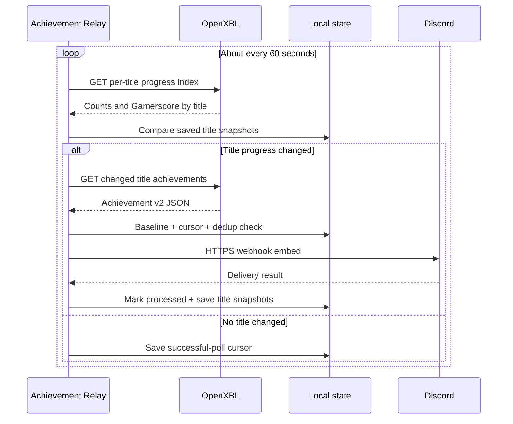

# Architecture

Achievement Relay is a local Windows desktop app with two projects:

- `AchievementRelay.Core` contains platform-neutral OpenXBL response parsing, API-key/webhook validation, deterministic event identity, settings models, and Discord payload construction.
- `AchievementRelay.App` contains the WPF/tray UI, OpenXBL and Discord HTTP clients, DPAPI secret storage, account polling, baseline/cursor state, event ledger, installer import, startup integration, and logging.

The MSIX manifest supplies package identity, `internetClient`, `runFullTrust`, the packaged startup task, and unvirtualized per-user AppData. The app's durable state remains under `%LOCALAPPDATA%\AchievementRelay`, with both the legacy full-trust declaration and an explicit Windows 11 virtualization exclusion. The one-time installer handoff uses `%USERPROFILE%\.achievement-relay` instead, which is outside AppData virtualization. Version 0.2 intentionally has no `userNotificationListener` capability.

## Poll and delivery path

`OpenXblClient` sends the user-supplied key only in the `X-Authorization` header to OpenXBL's current `https://api.xbl.io/v2/` endpoint. Requests time out after 20 seconds and response buffering is capped at 20 MiB. Provider and network failures become user-safe messages; the key is never included.

## Baseline, recovery, and duplicates

On the first verified account connection, `XboxSyncStateStore` records the complete first successful title snapshot and a baseline timestamp. Achievements already present in that response are intentionally ignored, preventing historical Discord floods. Monitoring begins from that verified snapshot.

Each successful poll records `LastSuccessfulPollUtc` and a per-title snapshot of unlocked count plus current Gamerscore. The inexpensive title index is polled every minute; detailed achievement JSON is requested only for new or changed titles. Later checks examine detailed unlocks newer than the baseline and use a 24-hour overlap before the last cursor. The overlap allows failed Discord posts to retry, while `EventLedger` prevents already handled events from posting twice. The cursor/title snapshot is not advanced past a pending provider or Discord delivery.

The overlap does not limit offline recovery: after several days offline, the cursor still begins at the previous successful poll, so achievements earned during downtime remain candidates when returned by OpenXBL.

Event IDs are SHA-256 hashes over a version marker, account XUID, service configuration, title, and achievement identifier. Upstream corrections to an unlock timestamp therefore cannot create a duplicate post. The ledger is capped at 1,000 entries and 90 days.

## Parsing boundary

`OpenXblResponseParser` accepts the Xbox Achievement v2-style JSON returned by OpenXBL. It:

1. accepts a documented `achievements` collection or root array;
2. keeps only entries explicitly marked achieved;
3. rejects revoked or timestamp-less entries;
4. maps title, description, Gamerscore, rarity, and icon when available; and
5. deduplicates by deterministic event identity.

The parser never interprets response data as code and does not log raw provider responses.

## Secrets and local state

| File | Contents |
|---|---|
| `settings.json` | Preferences, XUID, gamertag, and current-user DPAPI ciphertext for OpenXBL/Discord secrets |
| `xbox-sync-state.json` | Account ID, first-run baseline, last successful poll, and per-title achievement/Gamerscore snapshots |
| `processed-events.json` | Bounded deterministic IDs and processed timestamps |
| `achievement-relay.log` | Size-bounded operational messages; no intentional credentials or raw JSON |

`SecureWebhookProtector` retains the original webhook DPAPI entropy for upgrade compatibility and uses separate entropy for the OpenXBL API key. Decrypted byte arrays are zeroed after conversion; managed strings remain subject to normal .NET lifetime behavior.

## Installer handoff

The Inno Setup UI accepts optional credentials in password-masked controls. It does not add them to a process command line. Instead:

1. short-lived process environment variables are inherited by `Protect-InstallerSetup.ps1`;
2. that process applies current-user DPAPI using the same per-secret entropy as the app;
3. only ciphertext is written to `%USERPROFILE%\.achievement-relay\pending-installer-setup.json`;
4. installer variables/fields are cleared;
5. `InstallerSetupImporter` decrypts and validates the file;
6. normal settings are durably saved with fresh DPAPI ciphertext;
7. the handoff is truncated and deleted; and
8. only then does the importer verify OpenXBL and Discord.

If durable settings storage fails, the encrypted handoff is retained for the next launch. Version 0.2.1 also reads the legacy `%LOCALAPPDATA%\AchievementRelay` handoff path for compatibility. If setup is skipped, no handoff file is created.

## Upgrade behavior

Settings schema 1 is migrated to schema 2 while retaining the existing encrypted Discord webhook and preferences. `SetupCompleted` is reset so a 0.1.x user must explicitly connect OpenXBL. Legacy notification capture classes and manifest permissions are removed.
