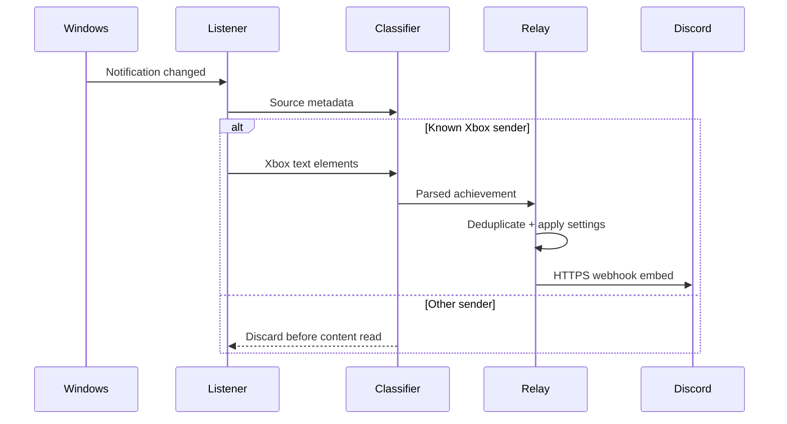

# Architecture

Achievement Relay is a local Windows desktop app with two projects:

- `AchievementRelay.Core` contains platform-neutral classification, parsing, fingerprints, webhook validation, and Discord payload construction.
- `AchievementRelay.App` contains WPF UI, WinRT notification capture, Windows startup integration, encrypted settings, Discord delivery, activity logging, and the tray lifecycle.

The MSIX manifest supplies package identity plus the `userNotificationListener`, `internetClient`, and `runFullTrust` capabilities.

## Event path

## Privacy boundary

`UserNotificationListener` exposes notifications broadly after the user grants access. `XboxNotificationListenerService` therefore retrieves source metadata first. It only calls `GetBinding(...).GetTextElements()` after `XboxNotificationClassifier` accepts a known Xbox package family. A display name alone is deliberately insufficient. Non-Xbox text does not enter application models, logs, settings, or network code.

## Parsing strategy

The MVP intentionally uses conservative heuristics:

1. Require a known Xbox source.
2. Require an achievement-unlock phrase or Gamerscore pattern.
3. Normalize and deduplicate text elements.
4. Remove generic unlock and score-only labels.
5. Treat the first remaining line as the achievement name.
6. Extract explicit `Game:`, `Title:`, or `In ...` lines when present.
7. Preserve uncertain remaining text as the description only when the user allows it.

Fixtures cover the privacy gate, common English notification shape, URL validation, mention suppression, and stable fingerprints. Real-world redacted fixtures should be added before widening heuristics.

## Delivery and state

- Settings live in `%LOCALAPPDATA%\AchievementRelay\settings.json`.
- The webhook URL is DPAPI-protected with `DataProtectionScope.CurrentUser` before serialization.
- Successful fingerprints live in `processed-events.json`, capped at 1,000 items and 90 days.
- Operational log lines live in `achievement-relay.log`, rotate at roughly 2 MB, and never intentionally include notification contents unrelated to Xbox or webhook tokens.
- Discord posts disable `allowed_mentions` to prevent an achievement title from pinging a role or `@everyone`.
- Network failures and server errors use bounded retry; permanent client errors stop immediately.

## Known constraint

This is an event observer, not an Xbox achievement database client. It cannot enumerate historical achievements, verify ownership, or recover an unlock after Windows removes the notification. It primes notifications present at startup to avoid surprising historical spam; the explicit **Re-scan** action can process items still held in Notification Center.
